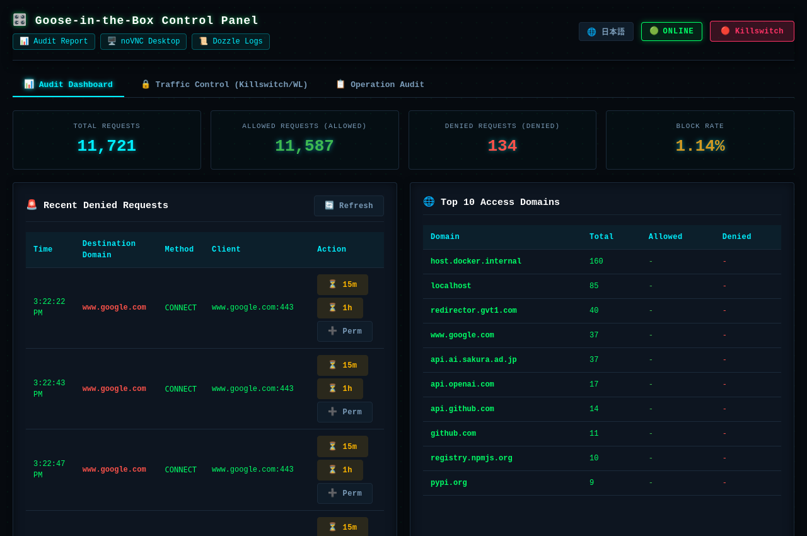
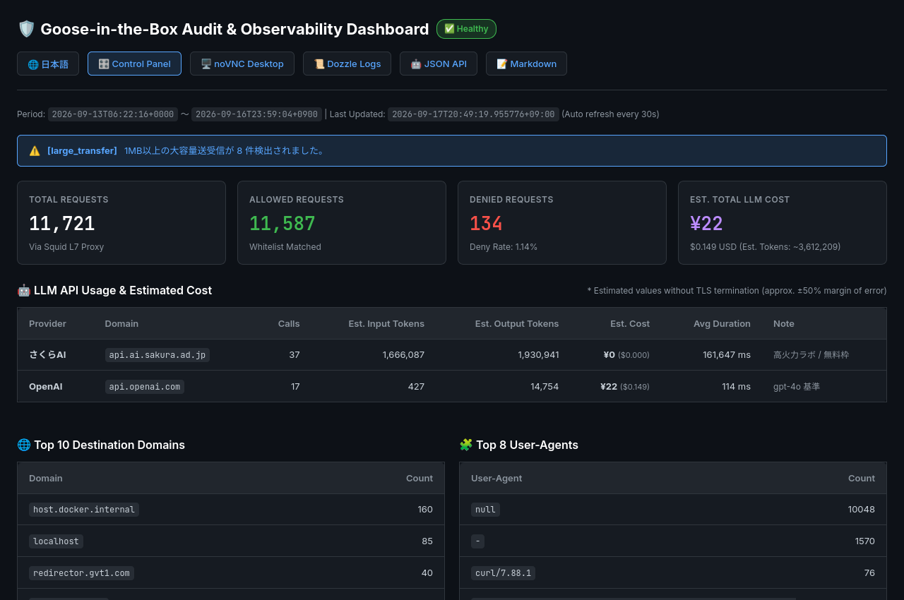

# Goose-in-the-Box: Network Isolation & Audit Sandbox for AI Agents

[](https://github.com/chottokun/goose-in-the-box/actions/workflows/ci.yml)
[](LICENSE)
[](docker-compose.yml)
[](https://block.github.io/goose/)
[](https://www.python.org/)

[English](README.en.md) | [日本語](README.md)

Goose-in-the-Box is a Docker-based network-isolated and audited sandbox designed for safely running the AI agent "Goose".

With a **dual-layer defense mechanism** consisting of Docker's `internal: true` network (L3/L4) and a Squid forward proxy (L7), it prevents unauthorized external communications and data exfiltration by AI agents. All connection attempts are recorded and audited in structured JSON logs. Additionally, Goose's anonymous telemetry transmission is disabled by default.

---

## Key Features

- 🔒 **Prevention of Proxy Bypasses (L3/L4 Isolation)**:
  - Agent containers reside within an `internal: true` network with no default gateway to the outside world.
  - Even if direct connection attempts (e.g., direct IP hits or DNS leaks) bypassing proxy configurations are made, the Linux kernel immediately drops the packets (`Network unreachable`).
- 🛡️ **Strict Whitelist Control (L7 Control)**:
  - The Squid proxy acts as the sole outbound gateway, allowing traffic only to domains listed in `squid/whitelist.txt`. Unapproved domains are blocked immediately with `403 Forbidden`.
- 📊 **Structured JSON Audit Logging**:
  - All network events (allowed, denied, HTTP status, domain, transferred bytes) are logged with ISO 8601 timestamps in `/var/log/squid/access.json`, enabling fast CLI filtering and aggregation.
- 🚫 **Telemetry Suppression**:
  - `GOOSE_TELEMETRY_ENABLED=false` is enforced to prevent the agent from sending telemetry data.

---

## Security Boundaries & Non-Goals

This sandbox is engineered to minimize the operational risks of autonomous AI agents. Please review the following guarantees and non-goals (out-of-scope items) before deployment:

### Security Guarantees
- 🔒 **Network Isolation (L3/L4 & L7)**: Docker's `internal: true` network removes default gateways to prevent direct packet routing. All outbound requests must transit the Squid forward proxy, where access is strictly confined to domains in the whitelist.
- 🛡️ **Non-Privileged Execution**: Containers do not run in privileged mode (`--privileged`) and execute under standard non-root user privileges (UID/GID 1000).
- 🚫 **No Docker Socket in Agent Container**: The host's Docker socket (`/var/run/docker.sock`) is never mounted inside the agent container (`goose-agent`), preventing agents from executing Docker commands on the host (management services `control-panel` and `dozzle` mount it read-only `:ro` strictly for container status and logs).
- 📁 **Restricted File Scope**: Host-shared files are strictly limited to `./workspace/` and designated config/log volumes. The agent cannot traverse or access the host's root file system or user home directories.

### Non-Goals (Out of Scope)
- ⚠️ **Host Kernel Zero-Day Exploits**: Because containers share the host Linux kernel, container escape attacks exploiting low-level kernel vulnerabilities are out of scope. For high-risk environments, running this sandbox inside a dedicated virtual machine (VM) is recommended.
- 🔍 **Deep Packet Inspection / SSL Decryption**: This sandbox does not decrypt HTTPS payloads (no MITM / SSL Bump). Traffic routing and audit logging rely on connection metadata (destination domain, port, byte volume, duration) via HTTP CONNECT tunneling, avoiding private CA certificate injection.

---

## Quick Start

### 1. Environment Setup
```bash
cp .env.example .env
```
> [!TIP]
> Open `.env` and set the API key for your preferred LLM provider (OpenAI, Anthropic, Gemini, Groq, etc.). If you are exclusively using Ollama (local LLM) on the host, no API keys are required.

### 2. Build Container Images
```bash
make build
```

### 3. Run Automated Isolation Test
Execute the test suite from inside the sandbox to verify that network controls are functioning as intended:
```bash
make test
```
**Test Coverage:**
1. ✅ **Whitelisted Domain (`api.openai.com`)**: Connects successfully through proxy
2. 🛑 **Unapproved Domain (`www.google.com`)**: Blocked with `403 Forbidden` by Squid
3. 🔒 **Direct Connection Bypass**: Dropped with `Network unreachable` via Docker `internal: true`

### 4. Running Goose (3 Execution Modes)
Once the tests pass, launch Goose in one of the following modes depending on your workflow:

- **Interactive CLI Session (Recommended & Fastest)**:
  ```bash
  make session
  ```
  Starts an interactive Goose CLI in your terminal, synchronized with `./workspace/` on the host, automatically loading `workspace/AGENTS.md` and `.agents/` rules.

- **In-Container Browser Desktop (UI Inspection & Web Browsing)**:
  ```bash
  make gui
  ```
  Open **`http://localhost:6080/vnc.html`** in your browser to view and control the Xfce4 virtual desktop inside the sandbox (or connect via native VNC to `localhost:5900`). Ideal when you want the agent to use browser tools or when inspecting full graphical outputs.

- **Goose Desktop Integration (Connect Host GUI Application)**:
  ```bash
  make serve
  ```
  Launches the Agent Communication Protocol (ACP) server. Connect your host Goose Desktop application to `http://localhost:3284`.

### 5. Teardown & Stopping Containers
To stop all running sandbox containers and free resources:
```bash
make down
```

---

## Sandbox Monitoring & Traffic Management

Goose-in-the-Box provides both intuitive **browser-based Web UIs** and terminal-friendly **CLI commands** for monitoring and controlling agent traffic.

### 1. Unified Web Management (Recommended)

#### 🎛️ Unified Control Panel (`make control`)
A centralized management dashboard to operate the emergency killswitch, modify domain whitelists dynamically, and manage temporary access authorizations (TTL):



```bash
make control
```
* **Access URL**: `http://localhost:6080/control/`
* 🔒 **Emergency Killswitch**: Instantly block or unblock all outbound agent network traffic with one click
* ⏳ **One-Click Temporary Whitelisting**: Grant 15-minute or 1-hour exemptions (or permanent additions) directly from blocked logs with real-time TTL countdown
* 📊 **Live Audit Dashboard**: Total requests, allowed/denied counts, deny rate, recent blocked logs, Top 10 destination domains
* 🌐 **Multilingual (i18n)** & 🔐 **Session Authentication** (via `CONTROL_PANEL_PASSWORD` in `.env`)

#### 📋 Dozzle Real-time Log Viewer
* **Access URL**: `http://<HOST_IP>:8080` (e.g., `http://localhost:8080`)
* Filter and search container logs cleanly without health check noise by selecting the `egress-proxy` container.

#### 📊 Observability Dashboard & APIs
Squid JSON logs (`/var/log/squid/access.json`) are automatically analyzed in the background (every 30 seconds) to provide human and LLM visibility:



* **Web UI Dashboard**: `http://<HOST_IP>:6080/report/` (Auto-refreshes every 30s with traffic volume, latency, and alert status)
* 🤖 **LLM JSON API**: `http://<HOST_IP>:6080/report/api/status.json` (Structured JSON for curl or LLM automated parsing)
* 📝 **LLM Markdown Summary**: `http://<HOST_IP>:6080/report/api/summary.md` (Context-optimized concise text summary)
* **Token & Cost Estimates (Experimental)**: Because HTTPS payloads are not decrypted, precise token counting is not feasible; values are rough order-of-magnitude estimates derived from transfer byte volumes for general reference.
* ⚙️ **Rate & Threshold Rules**: Configurable via `config/llm-pricing.json`

---

### 2. CLI Audit & Control Commands

Commands for terminal management and scripting pipelines:

| Command | Description |
| :--- | :--- |
| **`make logs`** | Stream real-time structured JSON audit logs |
| **`make watch`** | Real-time terminal color alerts for blocked connections (403 DENIED) |
| **`make audit-denied`** | List blocked domains and URLs from audit logs |
| **`make audit-summary`** | Summarize access frequency and byte transfer by destination domain |
| **`make audit-ingress`** | View incoming connection history to noVNC and ACP server |
| **`make audit-history`** | Cross-session comparison across rotated logs |
| **`make reload`** | Reload Squid configuration after editing `squid/whitelist.txt` without dropping connections |
| **`make block-all`** | **Emergency Killswitch**: Cut off all outbound traffic immediately |
| **`make unblock`** | Restore outbound traffic from backup whitelist |
| **`make report`** | Manually generate observability report and JSON/Markdown APIs |
| **`make log-rotate`** | Manually trigger Squid audit log rotation |
```

---

## Starter Environment & MCP Infrastructure

The sandbox includes pre-configured tooling and environments so AI agents can autonomously write code and interact with Model Context Protocol (MCP) servers:

1. **Core Utilities & Pre-configured Git**:
   - `git` pre-configured with `user.name` (Goose Agent), `user.email`, `safe.directory`, and `defaultBranch`.
   - `tmux` (background session persistence and mouse support enabled).
   - Core CLI tools: `build-essential` (make, gcc, etc.), `wget`, `unzip`, `nano`, `less`, `htop`, `tree`.
2. **Runtimes & MCP Infrastructure**:
   - **Python 3.11** + **`uv` / `uvx`**: Ultra-fast package management and on-demand MCP server execution.
   - **`pipx`**: Isolated CLI tool execution environment.
   - **Node.js** + **`npm` / `npx`**: Platform for running TypeScript/JavaScript MCP servers.
3. **Official Project Instructions (`.goosehints`)**:
   - Located at `/workspace/.goosehints`, defining recommended guidelines for agent execution.

---

## Workspace Sharing & Artifact Export

1. **Real-time Host Synchronization (Bind Mount)**:
   - Any files created or modified by Goose inside `/workspace` are immediately synchronized to `./workspace/` on the host machine.
2. **Artifact Export**:
   - Export workspace artifacts into a timestamped tar.gz archive:
     ```bash
     make export-workspace
     ```
     Archives are saved to `exports/workspace_YYYYMMDD_HHMMSS.tar.gz`.

---

## Configuration Parameters (.env)

All environment variables are centrally managed via the `.env` file (refer to `.env.example`).

| Parameter | Description | Default Value |
| :--- | :--- | :--- |
| **`HOST_BIND`** | Host IP binding configuration (`0.0.0.0` for all, `127.0.0.1` for local only) | `0.0.0.0` |
| **`OPENAI_API_KEY` etc.** | API keys for various LLM providers | (empty) |
| **`OPENAI_BASE_URL`** | OpenAI-compatible base URL (no trailing slash) | `https://api.openai.com/v1` |
| **`OPENAI_HOST`** | OpenAI-compatible hostname for provider resolution | `https://api.openai.com` |
| **`OLLAMA_HOST`** | Local LLM host endpoint (port 11434) | `http://host.docker.internal:11434` |
| **`NOVNC_PORT`** | noVNC Web UI port (browser access) | `6080` |
| **`GOOSE_SERVE_PORT`** | Goose ACP server listening port | `3284` |
| **`SQUID_PORT`** | Squid proxy listening port | `3128` |
| **`DOZZLE_PORT`** | Dozzle real-time log viewer Web port | `8080` |
| **`RESOLUTION`** | Virtual desktop screen resolution | `1280x800x24` |
| **`TZ`** | System timezone for logs and clock | `Asia/Tokyo` |
| **`SHM_SIZE`** | Shared memory size for virtual desktop stability | `1gb` |
| **`UID` / `GID`** | User ID / Group ID inside the container | `1000` / `1000` |
| **`GOOSE_TELEMETRY_ENABLED`** | Toggle for anonymous usage telemetry | `false` |

---

## Repository Structure

```text
goose-in-the-box/
├── docker-compose.yml       # Definitions for internal network (internal-net) and external proxy (external-net)
├── Makefile                 # Commands for build, test, session, GUI, log monitoring, and exports
├── README.md                # Japanese documentation
├── README.en.md             # English documentation (this file)
├── .env.example             # Template for environment variables and API keys
├── squid/
│   ├── squid.conf           # Strict forward proxy rules + JSON audit log definitions
│   └── whitelist.txt        # Allowed domain whitelist (LLMs, GitHub, PyPI, npm, etc.)
├── nginx/
│   └── nginx.conf           # Ingress reverse proxy configuration (noVNC WebSocket / ACP proxy / Control panel proxy)
├── control-panel/           # Unified Web Control Panel (FastAPI backend & Web SPA frontend)
│   ├── Dockerfile           # Standalone container definition for control panel
│   └── app/                 # Backend API (killswitch, whitelist, TTL, audit) and static SPA files
├── goose/
│   └── Dockerfile           # Goose Desktop/CLI + Xfce4/noVNC + Fcitx5 + uv/npm/tmux
├── bin/
│   ├── test-egress.sh       # Automated verification script for network isolation and proxy audit
│   ├── start-goose.sh       # Session startup script combining AGENTS.md / rules
│   ├── start-desktop.sh     # Startup script for Xfce4, VNC, websockify, Fcitx5, Goose Desktop
│   ├── audit-tools.sh       # Audit log aggregation and violation detection tools
│   ├── watch-alerts.sh      # Real-time alert monitoring with storm suppression and webhooks
│   ├── generate-report.sh   # Observability report and JSON/Markdown API generator
│   └── session-audit.sh     # Cross-session network traffic comparison
├── workspace/               # Goose working directory (real-time host bind mount)
│   ├── .goosehints          # Official project hints for Goose (Git, tmux, uv preferences)
│   ├── .gitignore           # Standard workspace ignore settings
│   ├── AGENTS.md            # Execution rules and security guidelines for AI agents
│   └── .agents/             # Skills and modularized rules
├── config/                  # Goose configuration directory (persisted host mount)
│   ├── config.yaml          # Provider (e.g. Ollama) and extension configs
│   └── llm-pricing.json     # Pricing model and alert thresholds for observability
├── data/                    # Storage for Goose internal persistent data
│   ├── sessions/            # Chat session history DB
│   └── logs/                # Goose internal application logs
├── logs/                    # Audit logs directory (accessible from host)
│   ├── squid/
│   │   ├── access.json      # Structured JSON audit log
│   │   └── access.log       # Standard text access log
│   ├── nginx/
│   │   └── ingress.json     # Ingress audit log
│   └── report/              # Dashboard Web UI and API outputs
└── plan/                    # Implementation and architecture documentation
```

---

## CI / Automated Test Pipeline

This repository uses GitHub Actions to automatically run a dual-stage CI pipeline on pushes and pull requests:

1. **Static Analysis & Syntax Verification (`static-analysis`)**:
   - Squid configuration syntax validation (`squid -k parse`)
   - Shell script static analysis (`shellcheck bin/*.sh`)
   - Nginx configuration syntax validation (`nginx -t`)
   - Docker Compose definition validation (`docker compose config --quiet`)
   - Embedded Python script syntax validation (AST parsing)
2. **Traffic Isolation & Observability Integration Tests (`integration-tests`)**:
   - Automated unit tests for control panel API (`make test-unit`)
   - Automated Docker container build
   - End-to-end egress control tests via L3/L4 internal network & L7 proxy (`make test`)
   - Verification of audit summaries, observability dashboard, and JSON/Markdown APIs (`make report`)
   - Automated archiving of audit logs and report artifacts (GitHub Actions Artifacts)

---

## License

This project is licensed under the [MIT License](LICENSE).

