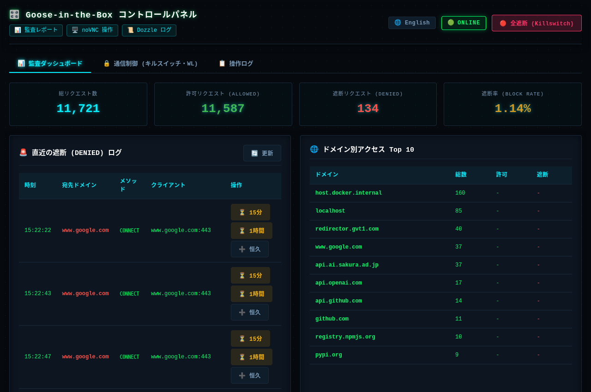
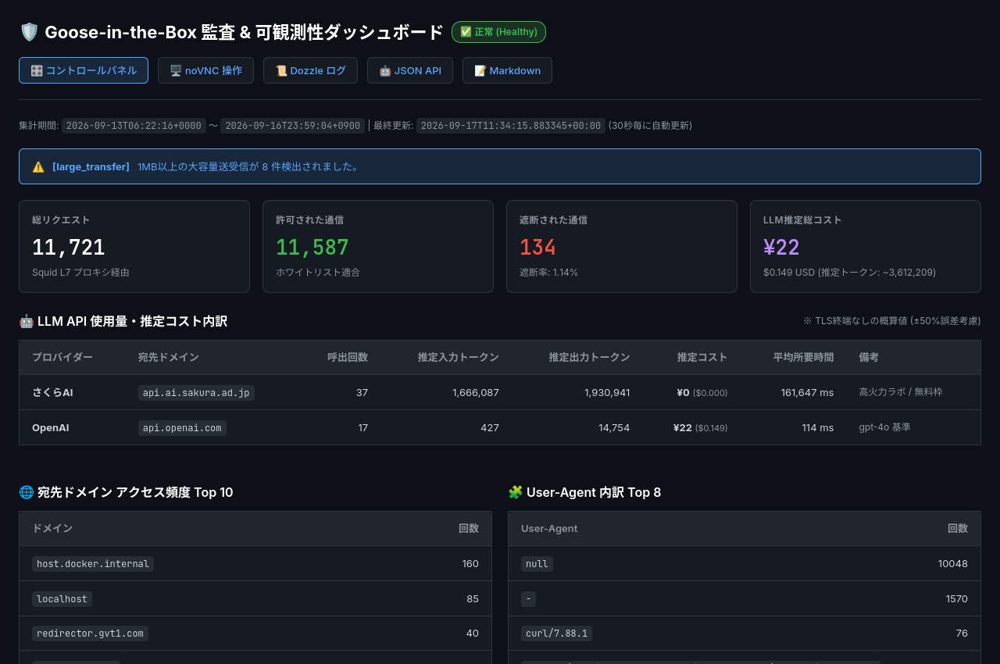

# Goose-in-the-Box: AI エージェントのネットワーク隔離・監査サンドボックス

[](https://github.com/chottokun/goose-in-the-box/actions/workflows/ci.yml)
[](LICENSE)
[](docker-compose.yml)
[](https://block.github.io/goose/)
[](https://www.python.org/)

[English](README.en.md) | [日本語](README.md)

AIエージェント「Goose」を安全に実行するための、Dockerベースのネットワーク隔離・監査サンドボックスです。

Docker の `internal: true` ネットワーク（L3/L4）と Squid フォワードプロキシ（L7）の **多層防御** により、エージェントによる未許可の外部通信や意図しないデータ流出を遮断し、全通信試行を構造化 JSON ログに記録・監査します。また、Goose 本体の匿名テレメトリ送信もデフォルトで無効化されています。

---

## 主な特徴

- 🔒 **プロキシバイパスの防止 (L3/L4 隔離)**:
  - エージェントコンテナは `internal: true` ネットワーク内に配置され、外部へのデフォルトゲートウェイが存在しません。
  - プロキシ設定を無視した直接通信（IP直撃やDNS漏洩）を試みても、Linux カーネルが即座にパケットを破棄します。
- 🛡️ **厳格なホワイトリスト制御 (L7 制御)**:
  - 外部と通信可能な唯一の出口である Squid プロキシが、`whitelist.txt` に登録されたドメイン宛てのみ通過を許可します。未許可ドメインは `403 Forbidden` で即座に遮断されます。
- 📊 **JSON 構造化監査ログ**:
  - 全通信（許可・遮断・HTTPステータス・ドメイン・送受信量）を ISO8601 タイムスタンプ付きの JSON 形式で `/var/log/squid/access.json` に記録。CLI で即座にフィルタリング・集計が可能です。
- 🚫 **テレメトリの無効化**:
  - `GOOSE_TELEMETRY_ENABLED=false` が適用され、エージェント自体の利用実績データ送信を抑止します。

---

## セキュリティ境界と設計前提 (Security Boundaries & Non-Goals)

本サンドボックスは、AI エージェントの自律実行に伴うリスクを軽減するために設計されています。運用の判断にあたり、以下のセキュリティ境界（保証事項）と前提（スコープ外事項）をご参照ください。

### セキュリティ境界 (Guarantees)
- 🔒 **ネットワーク隔離 (L3/L4 & L7)**: Docker の `internal: true` ネットワークによりデフォルトゲートウェイを排除し、直接通信を防止します。外部通信は唯一の出口である Squid プロキシを経由し、ホワイトリストに登録されたドメインのみ接続を許可します。
- 🛡️ **非特権コンテナ実行**: コンテナは特権モード（`--privileged`）を使用せず、一般ユーザー権限（UID/GID 1000）でプロセスを実行します。
- 🚫 **Docker ソケットの非公開**: エージェントコンテナ（`goose-agent`）にはホスト側の Docker ソケット（`/var/run/docker.sock`）は一切マウントされていません。エージェントがコンテナ内からホストの Docker デーモンを操作することはできません（※管理系コンテナ `control-panel` および `dozzle` のみ、コンテナ状態監視・ログ表示用に読み取り専用 `:ro` で参照）。
- 📁 **ファイルアクセスの局所化**: ホストと共有される領域はリポジトリ内の `./workspace/` ディレクトリおよび設定・ログ用ディレクトリに限定されており、ホストのルートファイルシステムや機密ファイルへのアクセス権はありません。

### 設計前提・スコープ外事項 (Non-Goals)
- ⚠️ **ホストOS・カーネル脆弱性への防御**: Docker コンテナはホストと Linux カーネルを共有しているため、カーネルレベルのゼロデイ脆弱性等を突いた高度なコンテナエスケープ攻撃への防御は保証外です。高機密環境では、ホストマシン自体を独立した仮想マシン（VM）上で運用することを推奨します。
- 🔍 **暗号化通信本文の検査 (DPI / SSL Bump)**: 本サンドボックスは SSL/TLS 通信の復号を行わず、HTTP CONNECT トンネルによる宛先ドメイン単位のルーティング制御・監査を行います。これにより、エージェントコンテナへの独自 CA 証明書注入や秘密鍵管理の複雑さを排し、安全かつ軽量に運用できます。

---

## クイックスタート

### 1. 初期設定
```bash
cp .env.example .env
```
> [!TIP]
> `.env` を開き、利用したい LLM（OpenAI, Anthropic, Gemini, Groq 等）の API キーを設定してください。ホスト上の Ollama（ローカル LLM）のみを使用する場合は API キーの設定は不要です。

### 2. コンテナイメージのビルド
```bash
make build
```

### 3. 通信遮断の実動テスト
隔離環境内から検証スクリプトを実行し、通信制御が正常に働いているかテストします：
```bash
make test
```
**テスト内容:**
1. ✅ **ホワイトリストドメイン (`api.openai.com`)**: プロキシ経由で正常に接続
2. 🛑 **非許可ドメイン (`www.google.com`)**: Squid プロキシが `403 Forbidden` で遮断
3. 🔒 **直接接続バイパス**: Docker `internal: true` により `Network unreachable` で遮断

### 4. Goose の起動（用途に応じた 3 つの実行モード）
テストが正常に完了したら、用途に合わせて以下のいずれかのモードで Goose を起動します：

- **CLI 対話セッション（推奨・最速）**:
  ```bash
  make session
  ```
  ターミナル上で対話型 Goose CLI を起動します。ホストの `./workspace/` とリアルタイム同期され、`workspace/AGENTS.md` や `.agents/` 内のルールを自動読み込みします。

- **ブラウザ仮想デスクトップ（画面確認・ブラウザ操作）**:
  ```bash
  make gui
  ```
  ホストのブラウザで **`http://localhost:6080/vnc.html`** を開くと、隔離コンテナ内の Xfce4 デスクトップがそのまま表示・操作できます（VNC クライアントからは `localhost:5900`）。エージェントにブラウザを操作させる場合や画面全体を確認したい場合に最適です。

- **Goose Desktop 連携（ホスト上の公式 GUI アプリから接続）**:
  ```bash
  make serve
  ```
  ACP サーバーを起動します。ホストマシン上で起動した公式 Goose Desktop アプリの接続先に `http://localhost:3284` を指定して作業します。

### 5. OpenCode の実行 (オプショナル)
本サンドボックス環境では、Goose に加えて **OpenCode** (https://opencode.ai/) も安全な隔離環境内で実行できます。

1. **OpenCode イメージのビルド**:
   ```bash
   make build-opencode
   ```
2. **OpenCode の起動**:
   ```bash
   make run-opencode
   ```
   隔離されたターミナルセッションで OpenCode が起動し、Goose と同様に `/workspace` マウントと Squid プロキシを通じた通信制御が適用されます。

### 6. コンテナの停止・後片付け
作業を終了し、起動中のコンテナを停止する場合は以下のコマンドを実行します：
```bash
make down
```

---

## サンドボックスの監視 & 通信制御

本環境では、ブラウザから直感的に操作できる **Web UI ツール群** と、自動化・ターミナル作業に適した **CLI コマンド群** の両方を提供しています。

### 1. Web UI による統合管理（推奨）

#### 🎛️ 統合コントロールパネル (`make control`)
ブラウザからワンクリックで緊急キルスイッチの作動や、ドメインホワイトリストの動的編集・一時許可 (TTL) が行える統合管理 UI です：



```bash
make control
```
* **アクセス URL**: `http://localhost:6080/control/`
* 🔒 **緊急キルスイッチ**: 全通信即座遮断 / 解除をワンクリックで実行
* ⏳ **ワンクリック一時ホワイトリスト化**: 遮断ログから 15分/1時間の一時許可（または恒久許可）をワンクリック付与（自動失効・リアルタイム TTL カウントダウン付き）
* 📊 **リアルタイム統計**: 総リクエスト、許可/遮断数、遮断率、直近の遮断ログ、ドメイン別 Top 10
* 🌐 **多言語 (i18n)** & 🔐 **セッション認証**（`.env` の `CONTROL_PANEL_PASSWORD`）対応

#### 📋 Dozzle リアルタイムログ監視
* **アクセス URL**: `http://<ホストIP>:8080` (例: `http://localhost:8080`)
* `egress-proxy` コンテナを選択することで、Squid のアクセスログ（`TCP_TUNNEL/200` や `TCP_DENIED/403` など）をヘルスチェックのノイズなしでリアルタイム監視・検索できます。

#### 📊 監査ログ・可観測性ダッシュボード & API
Squid の JSON ログ (`/var/log/squid/access.json`) をバックグラウンドで自動集計（30秒周期）し、可視化ダッシュボードと LLM 向け構造化 API を配信します：



* **Web UI ダッシュボード**: `http://<ホストIP>:6080/report/` (宛先別トラフィック量、所要時間、アラート推移)
* 🤖 **LLM 向け JSON API**: `http://<ホストIP>:6080/report/api/status.json` (スクリプトや外部エージェントによる自動パース用)
* 📝 **LLM 向け Markdown 要約**: `http://<ホストIP>:6080/report/api/summary.md` (コンテキスト消費を抑えたテキスト要約)
* **トークン・コスト推計（参考値）**: HTTPS 通信本文を復号しない仕様上、正確なトークン数の算出は困難なため、転送バイト数に基づく概算オーダー（お試し・参考値）として表示します。
* ⚙️ **単価・閾値設定**: `config/llm-pricing.json` で推計用モデル単価や各種アラート基準値を調整可能

---

### 2. CLI による監査・通信制御コマンド

ターミナル上での確認やスクリプト連携用の Makefile ターゲット一覧です：

| コマンド | 説明 |
| :--- | :--- |
| **`make logs`** | リアルタイム JSON 構造化監査ログのストリーミング表示 |
| **`make watch`** | 遮断された通信（403 DENIED）のリアルタイムカラーアラート監視（通知対応） |
| **`make audit-denied`** | ブロックされたドメイン・URL の一覧抽出 |
| **`make audit-summary`** | 宛先ドメイン別のアクセス頻度・転送量集計 |
| **`make audit-ingress`** | noVNC や ACP サーバーへの外部接続履歴一覧表示 |
| **`make audit-history`** | ローテーション済みログも含めた過去セッション横断の傾向比較 |
| **`make reload`** | `squid/whitelist.txt` 編集後の設定即時反映（通信切断なし） |
| **`make block-all`** | **緊急キルスイッチ**: 全通信を緊急遮断（ホワイトリストを空にして即時反映） |
| **`make unblock`** | キルスイッチ解除（元のホワイトリストを復元して即時反映） |
| **`make report`** | 監査ダッシュボードおよび JSON/Markdown API の手動即時生成 |
| **`make log-rotate`** | 監査ログの手動ローテーション実行 |
```

---

## 開発スターター環境 & MCP 基盤

本サンドボックスは、AI エージェントが自律的にコーディングやツール利用（MCP）を行えるよう、以下の環境があらかじめ整備されています：

1. **基本ツール & Git 自動設定**:
   - `git` は `user.name`（Goose Agent）、`user.email`、`safe.directory`、`defaultBranch` が事前設定済み。
   - `tmux`（セッション永続化・バックグラウンド管理、マウス有効化）
   - 基本ユーティリティ: `build-essential`（make, gcc等）、`wget`、`unzip`、`nano`、`less`、`htop`、`tree`
2. **言語ランタイム & MCP 拡張基盤**:
   - **Python 3.11** + **`uv` / `uvx`**: 高速パッケージ管理およびオンデマンド MCP サーバー実行。
   - **`pipx`**: 隔離環境での CLI ツール実行。
   - **Node.js** + **`npm` / `npx`**: TypeScript/JavaScript 系 MCP サーバー実行基盤。
3. **公式準拠のプロジェクト指示 (`.goosehints`)**:
   - `/workspace/.goosehints` に日本語対応、Git コミット指針、ハングアップ防止（常駐サーバーは `tmux` で起動）などの推奨指針が定義されています。

---

## 成果物のローカル共有 & エクスポート

1. **ホストマシンとのリアルタイム共有 (バインドマウント)**:
   - Goose が `/workspace` 配下に作成・編集したコードやファイルは、ホスト側の `./workspace/` にリアルタイムで直接反映されます。手元のエディタ（VS Code, IDE等）で即座に閲覧・編集可能です。
2. **成果物の一括アーカイブ**:
   - 成果物一式をタイムスタンプ付き tar.gz アーカイブとして書き出したい場合は、以下のコマンドを実行します：
     ```bash
     make export-workspace
     ```
     `exports/workspace_YYYYMMDD_HHMMSS.tar.gz` にアーカイブが出力されます。

---

## 設定パラメータ (.env)

環境設定はすべて `.env` ファイルで一元管理できます（`.env.example` を参考に設定）。

| パラメータ | 説明 | デフォルト値 |
| :--- | :--- | :--- |
| **`HOST_BIND`** | ホスト側公開IPバインド設定（全公開: `0.0.0.0`、ローカル限定: `127.0.0.1`、指定NIC-IP） | `0.0.0.0` |
| **`OPENAI_API_KEY` 等** | 各種 LLM プロバイダーの API キー | （空欄） |
| **`OPENAI_BASE_URL`** | OpenAI互換エンドポイント (さくらAI, vLLM, LocalAI等) ※末尾スラッシュなし | `https://api.openai.com/v1` |
| **`OPENAI_HOST`** | OpenAI互換ホスト名 (プロバイダー解決用) | `https://api.openai.com` |
| **`OLLAMA_HOST`** | ローカル LLM ホスト接続先 (ポート11434) | `http://host.docker.internal:11434` |
| **`NOVNC_PORT`** | noVNC Web UI ポート（ブラウザ接続先） | `6080` |
| **`GOOSE_SERVE_PORT`** | Goose ACP サーバー公開ポート | `3284` |
| **`SQUID_PORT`** | Squid 監査プロキシポート | `3128` |
| **`DOZZLE_PORT`** | Dozzle Web リアルタイムログ監視ポート | `8080` |
| **`RESOLUTION`** | 仮想デスクトップ解像度 | `1280x800x24` |
| **`TZ`** | タイムゾーン（時計・ログ出力時刻） | `Asia/Tokyo` |
| **`SHM_SIZE`** | 共有メモリサイズ（GUI安定化用） | `1gb` |
| **`UID` / `GID`** | コンテナ内実行ユーザー権限 | `1000` / `1000` |
| **`GOOSE_TELEMETRY_ENABLED`** | 匿名の利用実績データ送信制御 | `false` |

---

## ファイル構成

```text
goose-in-the-box/
├── docker-compose.yml       # 内部隔離(internal-net)と外部プロキシ(external-net)の定義
├── Makefile                 # ビルド、テスト、セッション起動、GUI、ログ監視、成果物出力
├── README.md                # 本ドキュメント
├── .env.example             # 設定パラメータ・APIキーテンプレート
├── squid/
│   ├── squid.conf           # 厳格なフォワードプロキシ設定 + JSON構造化監査ログ定義
│   └── whitelist.txt        # 許可ドメイン一覧（LLM, GitHub, PyPI, npm等）
├── nginx/
│   └── nginx.conf           # Ingressリバースプロキシ設定 (noVNC WebSocket / ACP中継 / コントロールパネル中継)
├── control-panel/           # 統合コントロールパネル (FastAPI バックエンド & Web SPA フロントエンド)
│   ├── Dockerfile           # コントロールパネル用独立コンテナ定義
│   └── app/                 # API (キルスイッチ・WL制御・TTL・監査) および SPA 静的ファイル
├── goose/
│   └── Dockerfile           # Goose Desktop/CLI + Xfce4/noVNC + Fcitx5 + uv/npm/tmux
├── bin/
│   ├── test-egress.sh       # 通信遮断・プロキシ迂回防止・監査ログの自動検証スクリプト
│   ├── start-goose.sh       # AGENTS.md / ルール自動結合とGoose対話セッション起動
│   ├── start-desktop.sh     # Xfce4, VNC, websockify, Fcitx5, Goose Desktop 起動スクリプト
│   └── audit-tools.sh       # 監査ログ集計・違反検出スクリプト
├── workspace/               # Goose作業ディレクトリ（ホストとリアルタイム同期）
│   ├── .goosehints          # Goose公式プロジェクト指示書（日本語、Git、tmux、uv優先）
│   ├── .gitignore           # ワークスペース標準除外設定（Python, Node, uv, OS一時ファイル）
│   ├── AGENTS.md            # 作業ルール・セキュリティガイドライン
│   └── .agents/             # スキルや分割ルールの配置場所
├── config/                  # Goose 設定ディレクトリ（ホストとマウント永続化）
│   └── config.yaml          # プロバイダー（Ollama等）および拡張機能設定
├── data/                    # Goose 内部データの永続化マウント先
│   ├── sessions/            # 会話セッション履歴 DB (Chat Recall用)
│   └── logs/                # Goose 内部ログ
├── logs/                    # Squid 監査ログ出力先（ホストから閲覧可能）
│   └── squid/
│       ├── access.json      # JSON 構造化監査ログ
│       └── access.log       # テキスト形式ログ
└── plan/
    ├── implementation_plan.md # 実装計画書 (v4: スターター・MCP環境完備)
    └── memo.md              # 実装仕様・要件メモ
```

---

## CI / 自動テストパイプライン

本リポジトリでは GitHub Actions により、プッシュおよびプルリクエスト時に以下の2段階パイプラインが自動実行されます：

1. **静的解析 & 構文検証 (`static-analysis`)**:
   - Squid 設定構文チェック (`squid -k parse`)
   - シェルスクリプト静的解析 (`shellcheck bin/*.sh`)
   - Nginx 設定構文チェック (`nginx -t`)
   - Docker Compose 定義構文検証 (`docker compose config --quiet`)
   - 埋め込み Python スクリプト構文検証 (AST パース)
2. **通信遮断 & 可観測性 実動テスト (`integration-tests`)**:
   - コントロールパネルのユニットテスト自動実行 (`make test-unit`)
   - Docker コンテナの自動ビルド
   - L3/L4 内部隔離および L7 プロキシ経由の通信遮断テスト (`make test`)
   - 監査集計・ダッシュボード・JSON/Markdown API 生成の動作検証 (`make report`)
   - 監査ログ・レポート成果物の自動保存（GitHub Actions アーティファクト）

---

## ライセンス

本プロジェクトは [MIT License](LICENSE) の下で公開されています。

