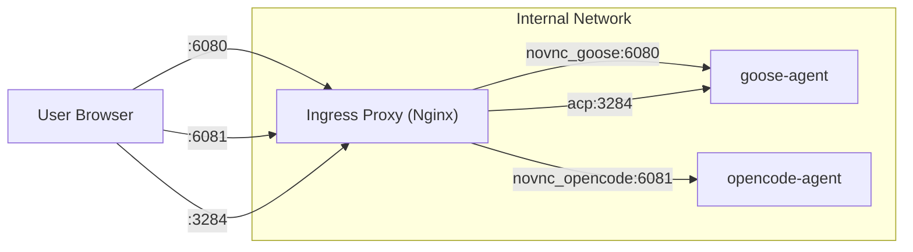

# Ingress ルーティングと監査

`ingress-proxy` コンテナ (Nginx) は、ホストマシン（または外部ネットワーク）から `internal-net` 内に存在するエージェントコンテナへの通信を安全に中継し、すべての接続履歴を監査ログとして記録する責務を担います。

## 構成図



## ポート割り当てと機能

| 公開ポート | 用途 | 転送先 | 備考 |
|:---:|:---|:---|:---|
| **6080** | Goose Desktop noVNC | `goose-agent:6080` | Webブラウザでの画面操作・WebSocket対応 |
| **3284** | Goose ACP Server | `goose-agent:3284` | 公式デスクトップアプリ連携用 |
| **6081** | OpenCode noVNC | `opencode-agent:6081` | OpenCode エージェントのデスクトップUI |
| (6080/control) | Control Panel | `control-panel:8000` | 管理用UI・APIへの内部ルーティング |

## WebSocket (noVNC) サポート

ブラウザ仮想デスクトップ（noVNC）を実現するため、Nginx は HTTP/1.1 の `Upgrade` ヘッダーを適切に処理し、WebSocket トラフィックを透過的にプロキシします。

```nginx
map $http_upgrade $connection_upgrade {
    default upgrade;
    ''      close;
}

# 中略
proxy_set_header Upgrade $http_upgrade;
proxy_set_header Connection $connection_upgrade;
```

長時間接続が維持されるよう、タイムアウト値（`proxy_read_timeout`, `proxy_send_timeout`）は `86400s` (24時間) に設定されています。

## Docker 内部 DNS による耐障害性

コンテナの起動順序や再起動時に Nginx がクラッシュする（Upstream Not Found）のを防ぐため、Docker の内部 DNS (127.0.0.11) を `resolver` として指定し、動的な名前解決を行っています。

```nginx
resolver 127.0.0.11 valid=5s ipv6=off;
set $upstream_novnc "http://goose-agent:6080";
proxy_pass $upstream_novnc;
```

## Ingress 監査ログ (`json_ingress`)

「誰が、いつ、どのエージェントに接続したか」を追跡するため、Nginx は構造化 JSON ログ (`json_ingress`) を出力します。
出力先はホストマシンの `logs/nginx/ingress.json` にマウントされ、Control Panel や監査ツールからパース可能です。

**ログフォーマット**:
```nginx
log_format json_ingress escape=json
    '{"time":"$time_iso8601",'
    '"remote_addr":"$remote_addr",'
    '"method":"$request_method",'
    '"uri":"$request_uri",'
    '"status":$status,'
    '"bytes_sent":$bytes_sent,'
    '"upstream":"$upstream_addr",'
    '"user_agent":"$http_user_agent",'
    '"connection_upgrade":"$http_upgrade"}';
```
