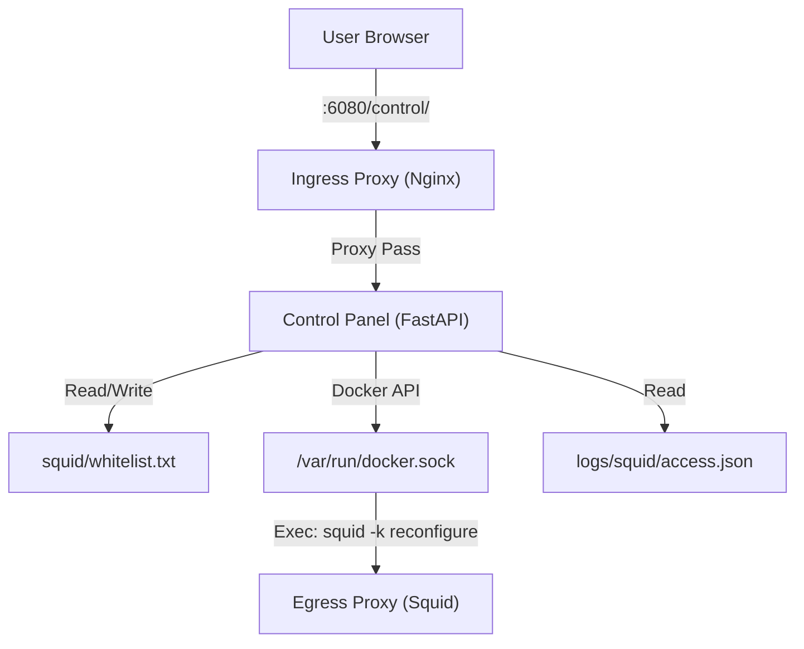

# 統合コントロールパネル (Control Panel)

`control-panel` は、Goose-in-the-Box におけるネットワーク制御・監査を直感的な Web UI および REST API を通じて行うための独立したサービスです。

## 技術スタック

- **Backend**: FastAPI (Python 3.11+)
- **Frontend**: Vanilla JavaScript + HTML5 + CSS3 (SPA風構成)
- **Deployment**: 独立コンテナ (`control-panel:8000`)
- **Routing**: `ingress-proxy` (Nginx) 経由で `http://localhost:6080/control/` としてルーティング

## アーキテクチャ

## 主な機能と設計

### 1. 動的ホワイトリスト再構成 (Dynamic Whitelist)
`whitelist.txt` の編集と、それを反映させるための Squid 再起動（`squid -k reconfigure`）をワンクリックで行います。
コントロールパネルコンテナは、ホストの Docker ソケット（読み取り専用ではなく、実行権限付き）をマウントして、対象の `egress-proxy` コンテナにコマンドを発行します。

### 2. 一時許可 TTL (Time-To-Live)
「一時的に特定のパッケージをインストールしたい」というケースに対応するため、TTL 付きのホワイトリスト許可機能を提供します。
- **期間**: 15分 または 1時間
- **仕組み**: メモリ上で一時的なドメインリストと有効期限を管理。バックグラウンドタスクが 10秒 ごとに有効期限をチェックし、期限切れドメインをリストから削除して自動的に Squid をリロードします。
- **利点**: 作業終了後のリストからの削除忘れを防ぎ、セキュリティを維持します。

### 3. キルスイッチ API (Emergency Killswitch)
緊急時に全ネットワーク通信を遮断する機能です。
キルスイッチが有効化されると、`whitelist.txt` の内容をメモリ上に退避させた上でファイルを空にし、即座に設定をリロードします。

### 4. 異常系ハンドリングとセキュリティ
- **グローバル例外ハンドラ**: `main.py` に実装されており、未処理の例外が発生した場合でも、スタックトレースを露出せず、統一された JSON エラー構造（`message_ja`, `message_en`）を返します。
- **セキュリティヘッダー**: `X-Content-Type-Options`, `X-Frame-Options` などの HTTP セキュリティヘッダーをミドルウェアで自動付与します。
- **入力バリデーション**: ドメイン追加APIなどでは、正規表現を用いた厳密な形式チェックを行い、不正な文字列（改行インジェクションなど）を弾きます。
- **認証**: `.env` で `CONTROL_PANEL_PASSWORD` が設定されている場合、セッションベースの認証を要求します。
