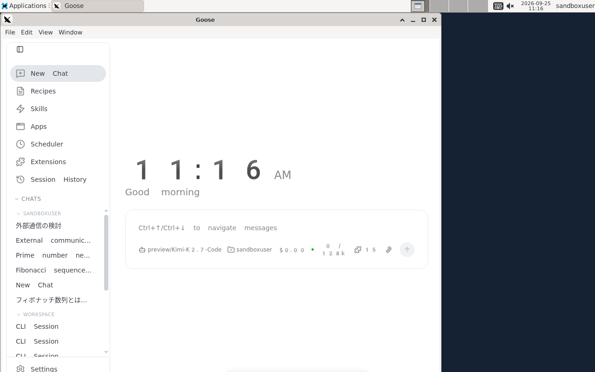
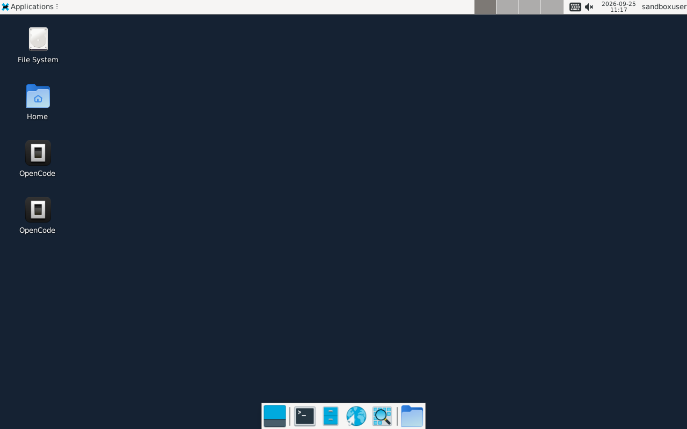
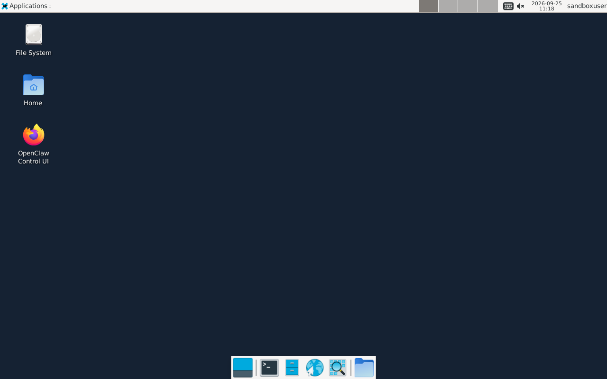

# 仮想デスクトップ環境

AI エージェントにブラウザを操作させたり、GUI ツールを使用させたりするため、エージェントコンテナ内にヘッドレスの仮想デスクトップ環境を構築しています。

## 構成スタック

- **X Server**: `Xvfb` (X Virtual Framebuffer) - 物理ディスプレイを持たない仮想 X サーバー
- **Window Manager / Desktop**: `Xfce4` - 軽量なデスクトップ環境
- **VNC Server**: `x11vnc` - X サーバーの画面を VNC プロトコルで配信
- **Web UI / WebSocket**: `websockify` + `noVNC` - VNC プロトコルを WebSocket に変換し、ブラウザで描画
- **IME (日本語入力)**: `Fcitx5` + `Mozc` - 日本語入力メソッドフレームワークと変換エンジン

## 起動フロー (`start-desktop.sh`)

コンテナ起動時、以下の順序でプロセスが立ち上がります。

1. **Xvfb の起動**:
   ```bash
   Xvfb :1 -screen 0 ${RESOLUTION:-1280x800x24} -nolisten tcp &
   export DISPLAY=:1
   ```
2. **D-Bus セッションバスの開始**:
   Fcitx5 や一部の GUI アプリケーションがプロセス間通信を行うために必要です。
   ```bash
   eval "$(dbus-launch --sh-syntax)"
   ```
3. **Xfce4 の起動**:
   ```bash
   startxfce4 &
   ```
4. **Fcitx5 の起動**:
   日本語環境変数 (`GTK_IM_MODULE`, `QT_IM_MODULE`, `XMODIFIERS`) を設定し、デーモンとして起動します。
   ```bash
   fcitx5 -d
   ```
5. **x11vnc の起動**:
   ローカルループバックのみにバインドし、外部からの直接接続を防止します。
   ```bash
   x11vnc -display :1 -nopw -forever -shared -bg -listen 127.0.0.1 -rfbport 5900
   ```
6. **websockify (noVNC) の起動**:
   VNC ポート (5900) を WebSocket ポート (6080/6081) に変換し、Web クライアント（Nginx Ingress 経由）に提供します。

## 仮想デスクトップ画面 (GUI スクリーンショット)

各エージェントのコンテナ内で稼働する仮想デスクトップの様子です。

**Goose Desktop GUI** (`make gui` -> http://localhost:6080/vnc.html)


**OpenCode Desktop GUI** (`make run-opencode-gui` -> http://localhost:6081/vnc.html)


**OpenClaw Desktop GUI** (`make run-openclaw-gui` -> http://localhost:6082/vnc.html)


## Goose Agent GUI の実行

Goose Agent の公式 GUI (Electron アプリ) は、Linux 上で実行する際に Sandbox 関連のエラーが発生しやすいため、ラッパースクリプトを介して `--no-sandbox` などのオプションを付与して起動されます。
また、Fcitx5 による日本語入力を受け付けるために、Electron に対する Ozone ウェイランド/X11 IM のオプション (`--enable-wayland-ime` 等) が必要になる場合があります。
