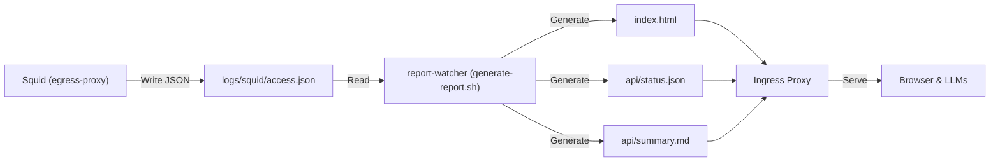

# 可観測性と監査ダッシュボード

Goose-in-the-Box は、エージェントの自律的な動作を可視化し、ネットワーク利用状況を監視するための軽量な可観測性基盤を内蔵しています。

## Dozzle リアルタイムログ監視

ホストのポート `8080` で稼働する Dozzle コンテナにより、Web ブラウザから全コンテナのログをリアルタイムで閲覧・検索できます。
特に `egress-proxy` コンテナのログを監視することで、どのドメインがブロック（`403 Forbidden`）されたかを即座に把握できます。

```yaml
# docker-compose.yml
dozzle:
  image: amir20/dozzle:latest
  ports:
    - "${HOST_BIND:-127.0.0.1}:${DOZZLE_PORT:-8080}:8080"
  volumes:
    - /var/run/docker.sock:/var/run/docker.sock:ro
```

## Report-Watcher 自動集計

Grafana や Elasticsearch などの重量級スタックを避け、シェルスクリプト (`bin/generate-report.sh`) と軽量コンテナ (`report-watcher`) による自動集計を採用しています。

### 動作フロー

1. `egress-proxy` が `/var/log/squid/access.json` に監査ログを追記。
2. `report-watcher` コンテナ内のループスクリプトが、一定間隔（デフォルト30秒）で `generate-report.sh` を実行。
3. スクリプトは JSON ログをパース（`jq`, `awk`）し、以下の 3 つの成果物を生成・上書き保存する。
   - `index.html` (Web UI 用の HTML ダッシュボード)
   - `api/status.json` (LLM や外部ツール向けの構造化データ)
   - `api/summary.md` (LLM がコンテキストとして読み込みやすい Markdown 要約)
4. 生成されたファイルは `logs/report/` に保存され、`ingress-proxy` を通じて `http://localhost:6080/report/` でサーブされる。



## トークンコスト推計機能

HTTPS 通信のペイロードを復号しないため、正確なトークン数は計測できません。
代わりに、ログに記録された通信転送量（バイト数）と、`config/llm-pricing.json` に定義されたモデル単価設定を用いて、コストの概算（オーダー推定）を算出・表示します。
